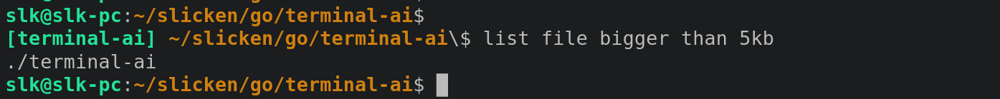

# terminal-ai

**terminal-ai** is a small, **lightweight** helper for your terminal: you get a short **prompt**, describe what you want in plain language, and it turns that into a **Linux shell command**, runs it with `sh -c`, and shows the output. Use it when you forget flags, pipeline order, or the right tool—without leaving the shell or opening a full-screen app.

It talks to a local or cloud **Ollama** model, suggests **one** command at a time, then exits so your normal shell prompt returns.

**Interactive mode** (the default) prints a prompt, reads **one** line, runs the workflow above, and quits. Map a **hotkey** (e.g. **Alt+P** via your terminal or Bash `bind -x`) to `terminal-ai`, or run `./terminal-ai` whenever you need it.

## Requirements

- **Go** (to build)
- **Ollama**: local server and model, *or* [Ollama Cloud](https://ollama.com) with an API key

## Build and install

```bash
cd /path/to/terminal-ai
go build -o terminal-ai .
```

Put the binary on your `PATH`, or configure your terminal shortcut with the full path.

## CLI

```bash
terminal-ai                          # interactive: one line, then exit
terminal-ai interactive              # same
terminal-ai ask list files here      # non-interactive (no prompt)
terminal-ai ask < file.txt           # query from stdin (whole file / stream)
terminal-ai help
```

## Prompt modes (`TERMINAL_AI_PROMPT`)

### Default (label mode)

If **`TERMINAL_AI_PROMPT`** does **not** contain **`%w`**, **`%u`**, or **`%h`**, the value is treated as a **short label** only (like `user@host` in a normal prompt). The app builds a line in the style **`Label:path$ `**:

- **Label** — from the env var; if unset or empty, **`TerminalAI`**
- **Path** — current working directory with `~` when under `$HOME`
- **Colors** (unless **`NO_COLOR`** is set): bold green label, white `:`, bold blue path, white `$` and a trailing space

Example with a custom label:

```bash
export TERMINAL_AI_PROMPT=MyAI
# Renders like: MyAI:~/project$ 
```

While the model is **thinking**, a **wave animation** runs **in the label area** (same colors as the label); **`:path$ `** and your typed text stay on the same row.

### Legacy (full template)

If the value **contains** **`%w`**, **`%u`**, or **`%h`**, **full template mode** is used (previous behavior): the string is expanded and printed as-is.

| Placeholder | Replaced with |
|-------------|----------------|
| **`%w`** | Current directory, `~` for home |
| **`%u`** | **`$USER`** |
| **`%h`** | Short hostname (segment before first `.`) |
| **`%%`** | A literal **`%`** |

In this mode the thinking indicator uses a **`[wave]`**-style segment and **`TERMINAL_AI_SPINNER_PREFIX_RUNES`** (default **12**) controls how many **visible** characters at the start of the expanded prompt count as the “prefix” before that segment (ANSI escape sequences are not counted).

## Environment variables

| Variable | Purpose | Default |
|----------|---------|---------|
| **`OLLAMA_HOST`** | Base URL of your **local** Ollama HTTP API (no trailing slash). Ignored when **`OLLAMA_API_KEY`** is set. | `http://127.0.0.1:11434` |
| **`OLLAMA_MODEL`** | Model name passed to `/api/generate`. | `gemma4:e2b` |
| **`OLLAMA_API_KEY`** | If set (non-empty), requests go to **`https://ollama.com/api/generate`** (Ollama Cloud) with `Authorization: Bearer …`. | *(unset → local server)* |
| **`TERMINAL_AI_PROMPT`** | **Label mode:** short name (e.g. `TerminalAI`). **Legacy:** full template with **`%w`** / **`%u`** / **`%h`** / **`%%`**. | Label **`TerminalAI`** when unset |
| **`TERMINAL_AI_HOTKEY`** | Byte sequence that **cancels** interactive input (toggle back to the shell). Go-style escapes: **`\e`** = ESC, **`\xNN`**, etc. | **`\\ep`** (ESC then `p`, typical **Alt+P** on xterm-like terminals) |
| **`TERMINAL_AI_SHELL_LINE`** | If set, this **exact** string is redrawn on the same row when you cancel with the hotkey (optional; see below). | *(unset)* |
| **`TERMINAL_AI_EXPAND_PS1`** | If unset or **`1`**, cancel redraw tries **`bash -c 'printf %s "${PS1@P}"'`** to repaint the shell prompt. Set **`0`** to skip. | on |
| **`TERMINAL_AI_SPINNER_PREFIX_RUNES`** | **Legacy prompts only:** visible runes counted from the start of the expanded prompt before the **`[thinking]`** block. | `12` |
| **`NO_COLOR`** | If set, disables ANSI colors in the default label prompt and spinners. | *(unset)* |

**Legacy colored prompt** example (full control via placeholders):

```bash
export TERMINAL_AI_PROMPT=$'\033[1;33m%u\033[0m@\033[1;32m%h\033[0m \033[1;34m%w\033[0m [ai]\$ '
terminal-ai
```

## Hotkey and cancel

**Terminal shortcut:** map **Alt+P** (or any key) to `terminal-ai` or `/path/to/terminal-ai`.

**Bash `bind -x`:**

```bash
export TERMINAL_AI_BIN=/path/to/terminal-ai
terminal_ai_run() {
  "$TERMINAL_AI_BIN"
  READLINE_LINE=
  READLINE_POINT=0
}
bind -x '"\ep":"terminal_ai_run"'
```

Configure the same sequence with **`TERMINAL_AI_HOTKEY`** (default **`\\ep`**) so cancel matches your binding.

On cancel, the app restores the TTY to **cooked** mode, runs **`stty sane`** on **`/dev/tty`** (or stdin), then optionally redraws your shell line: **`TERMINAL_AI_SHELL_LINE`** if set, otherwise expanded **`${PS1@P}`** via bash when **`TERMINAL_AI_EXPAND_PS1`** is not **`0`**.

Interactive mode opens **`/dev/tty`** when possible and runs **`stty sane`** on startup (Unix) so typing works after **`bind -x`**.

## Security

The model may suggest **any** shell command; the tool runs it under **`sh -c`**. Only use models and hosts you trust, and avoid pasting sensitive data into prompts.

## Example



Place **`terminal-ai.png`** in the **repository root** next to this README (same folder as `go.mod`) so the image loads on GitHub and in editors that render relative paths.

## License

[MIT](LICENSE) — Copyright (c) 2026 slicken
